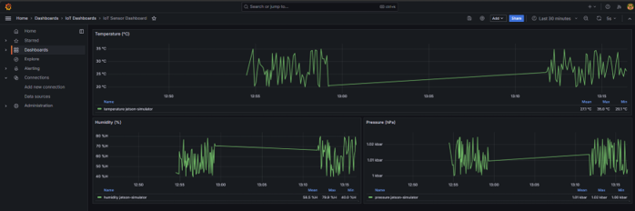
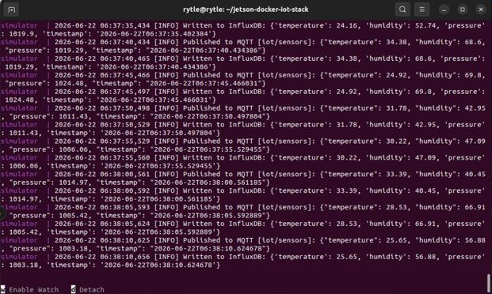

# jetson-docker-iot-stack

A production-ready Docker Compose IoT stack running on **NVIDIA Jetson Orin Nano** (ARM64).  
Spins up a complete IoT data pipeline with a single command, no extra hardware required.

## Stack

| Service | Role | Port |
|---|---|---|
| **Mosquitto** | MQTT broker - receives sensor messages | 1883 |
| **InfluxDB 2.7** | Time-series database - stores all readings | 8086 |
| **Grafana 10.4** | Live dashboard - visualizes the data | 3000 |
| **Simulator** | Python script - publishes fake sensor data | -- |

## Architecture

```
┌─────────────────────┐
│   Simulator (Python)│
│   simulate.py       │
└──────────┬──────────┘
           │ MQTT publish
           ▼
┌─────────────────────┐
│  Mosquitto Broker   │
└──────────┬──────────┘
           │ subscribe
           ▼
┌─────────────────────┐
│  InfluxDB 2.7       │
└──────────┬──────────┘
           │ query
           ▼
┌─────────────────────┐
│  Grafana 10.4       │
└─────────────────────┘
```

## Prerequisites

- NVIDIA Jetson Orin Nano with JetPack installed
- Docker Engine 20.x+
- Docker Compose v2+

Verify:
```bash
docker --version
docker compose version
```

## Getting Started

```bash
# Clone the repo
git clone https://github.com/tkrithika/jetson-docker-iot-stack.git
cd jetson-docker-iot-stack

# Launch the full stack
docker compose up --build -d
```

Wait ~15 seconds for all services to initialise, then open Grafana:
http://<your-jetson-ip>:3000

Login: `admin` / `admin1234`

Navigate to **Dashboards → IoT Dashboards → IoT Sensor Dashboard** to see live data.

## Live Dashboard

The dashboard auto-refreshes every 5 seconds and shows the last 30 minutes of data:

- **Temperature** (°C) - full width chart
- **Humidity** (%) - half width chart
- **Pressure** (hPa) - half width chart



## Simulator

The included Python simulator publishes fake sensor readings every 5 seconds to MQTT and writes directly to InfluxDB:

```python
{
  "temperature": 24.3,   # °C  (range: 20–35)
  "humidity":    61.2,   # %   (range: 40–80)
  "pressure":    1013.5  # hPa (range: 1000–1025)
}
```

This lets the entire pipeline run and be tested without any physical sensors.



## Roadmap

- **v1.0** *(current)* - Full pipeline with Python data simulator
- **v2.0** - Real sensor data 

## Project Structure

```
jetson-docker-iot-stack/
│
├── docker-compose.yml
│
├── mosquitto/
│   └── mosquitto.conf
│
├── grafana/
│   └── provisioning/
│       ├── dashboards/
│       │   ├── dashboard.yml
│       │   └── iot-dashboard.json
│       └── datasources/
│           └── influxdb.yml
│
├── simulator/
│   ├── Dockerfile
│   ├── requirements.txt
│   └── simulate.py
│
└── docs/
    └── grafana-dashboard.png
```

## Tested On

- **Hardware:** NVIDIA Jetson Orin Nano Developer Kit
- **OS:** Ubuntu 22.04 (JetPack)
- **Docker:** 29.1.3
- **Docker Compose:** v5.0.0
- **Architecture:** ARM64

## Related Repositories

- [jetson-orin-nano-headless-vnc-setup](https://github.com/tkrithika/jetson-orin-nano-headless-vnc-setup)
- [jetson-opencv-cuda-build-guide](https://github.com/tkrithika/jetson-opencv-cuda-build-guide)

## Note

This is the first version of an ongoing IoT edge computing project built on the NVIDIA Jetson Orin Nano.  
The current stack uses a Python-based data simulator to demonstrate the full pipeline from data generation to live visualization without requiring any physical sensors.

This foundation will be extended in future versions with real sensor hardware, moving from simulated data to actual real-world measurements flowing through the same pipeline.

## License

MIT License - feel free to use, modify and build on this.
